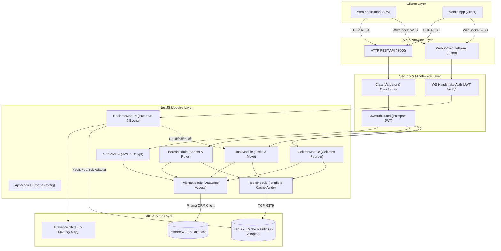
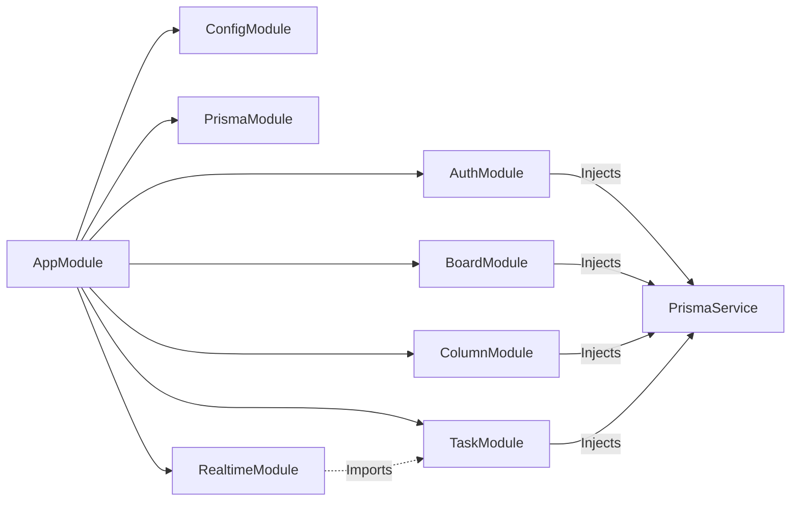
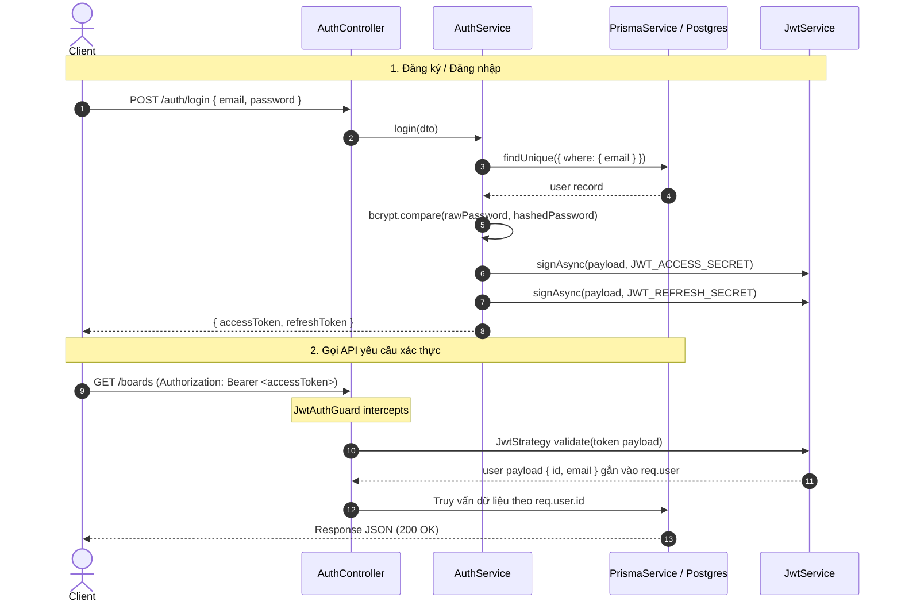
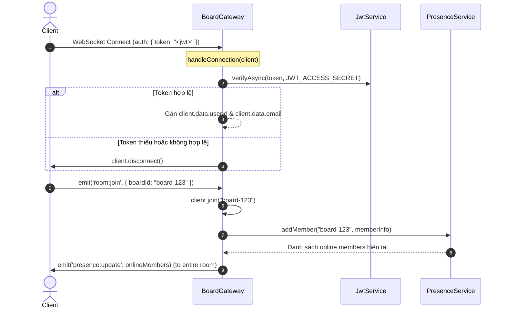

# Kiến trúc Hệ thống BambooSync Server (System Architecture)

Tài liệu này mô tả chi tiết kiến trúc kỹ thuật của **BambooSync Server** — thành phần Backend xử lý nghiệp vụ quản lý bảng cộng tác thời gian thực (Kanban-style), xác thực người dùng và truyền phát sự kiện đồng bộ trực tiếp.

---

## 1. Sơ đồ Tổng quan Hệ thống (System Overview)

Hệ thống được xây dựng theo mô hình **Modular Monolith** trên nền tảng **NestJS**, tích hợp song song hai giao thức giao tiếp: **HTTP/REST** cho các tác vụ đột biến dữ liệu (CRUD mutations) và **WebSocket (Socket.IO)** cho việc truyền phát trạng thái thời gian thực (Realtime updates & Ephemeral Presence).

---

## 2. Các Module Chính và Giao tiếp Liên Module

Toàn bộ ứng dụng được tổ chức thành các module khép kín (Encapsulated Modules) theo tiêu chuẩn NestJS:

### Chi tiết vai trò từng Module:

1. **`AppModule` (`src/app.module.ts`)**:
   - Module gốc gom toàn bộ các tính năng, nạp cấu hình toàn cục qua `ConfigModule.forRoot()`.
   - Cung cấp `AppController` với endpoint kiểm tra sức khỏe hệ thống (`GET /health`).

2. **`PrismaModule` & `PrismaService` (`src/prisma/`)**:
   - Kế thừa `PrismaClient`, đóng vai trò là Singleton provider quản lý kết nối cơ sở dữ liệu PostgreSQL.
   - Triển khai vòng đời `OnModuleInit` (`$connect()`) và `OnModuleDestroy` (`$disconnect()`), bật chế độ logging SQL query ở cấp độ sự kiện.

3. **`AuthModule` (`src/auth/`)**:
   - Quản lý đăng ký tài khoản (`RegisterDto`), băm mật khẩu bằng `bcrypt` (10 rounds).
   - Xác thực đăng nhập (`LoginDto`) và cấp phát cặp JWT Token: **Access Token** và **Refresh Token**.
   - Khởi tạo `JwtStrategy` kế thừa từ `passport-jwt` để giải mã Bearer Token.

4. **`BoardModule` (`src/board/`)**:
   - Quản lý vòng đời Board: Tạo mới, xem danh sách cá nhân, xem chi tiết Kanban Board (bao gồm Cột và Tasks), cập nhật, xóa và tham gia qua `inviteCode`.
   - Khi tạo Board mới, hệ thống tự động khởi tạo 3 cột mặc định: `"To Do"`, `"Doing"`, `"Done"` và gán user tạo thành `OWNER`.
   - Xử lý kiểm tra quyền truy cập Board (Owner, Editor, Viewer).

5. **`ColumnModule` (`src/collumn/`)**:
   - Xử lý thêm, sắp xếp lại (reorder) và xóa cột trong bảng.
   - Thao tác sắp xếp lại cột sử dụng `prisma.$transaction` để bảo đảm tính toàn vẹn (atomic).

6. **`TaskModule` (`src/task/`)**:
   - Xử lý nghiệp vụ công việc: Tạo task mới, cập nhật thuộc tính (priority, due date), di chuyển task giữa các cột hoặc đổi thứ tự (`PATCH /tasks/:id/move`), xóa task.
   - Tự động tính toán thứ tự (`order`) dựa trên tổng số task hiện có trong cột.

7. **`RealtimeModule` (`src/realtime/`)**:
   - `BoardGateway` (`src/realtime/gateways/board.gateway.ts`): Quản lý kết nối Socket.IO, phòng làm việc (Rooms), bắt sự kiện di chuyển con trỏ chuột (`cursor:move`), trạng thái soạn thảo (`typing:start`, `typing:stop`), phát sóng đột biến task (`task.created`, `task.moved`, v.v.).
   - `RedisIoAdapter` (`src/realtime/adapters/redis-io.adapter.ts`): Cung cấp adapter Socket.IO trên nền Redis Pub/Sub (`@socket.io/redis-adapter`) hỗ trợ scale ngang đa container đằng sau Load Balancer.
   - `PresenceService` (`src/realtime/services/presence.service.ts`): Lưu trữ trạng thái danh sách thành viên đang trực tuyến (online) trên từng Board.

8. **`RedisModule` & `RedisService` (`src/redis/`)**:
   - Module toàn cục (`@Global()`) đóng gói client `ioredis`, kết nối tới Redis 7 tại port 6379.
   - Cung cấp cơ chế Cache-Aside (Lazy Loading) kèm TTL cho các truy vấn xem chi tiết bảng (`GET /boards/:id`) và cơ chế Invalidation khi có đột biến dữ liệu.
   - Tích hợp tính năng Graceful Degradation (tự động bypass sang PostgreSQL nếu Redis gặp sự cố, không để crash ứng dụng).

---

## 3. Luồng Dữ liệu (Data Flow)

### 3.1. Luồng Xác thực và Ủy quyền (Authentication & Authorization)

### 3.2. Luồng Xác thực WebSocket & Quản lý Phòng (Presence & Socket Handshake)

### 3.3. Luồng Thao tác Dữ liệu Kết hợp Thời gian Thực (REST + Realtime Broadcast)

Kiến trúc hiện tại phân định rõ:
1. **Thay đổi dữ liệu (Mutations)**: Thực hiện qua **HTTP REST API**. Client gửi request, nhận mã phản hồi HTTP chuẩn (200/201/400/403/404). Việc này đảm bảo tính tương thích cao, dễ cache, kiểm soát lỗi và validation chặt chẽ.
2. **Đồng bộ sự kiện (Broadcasting)**: Được thực hiện qua **Socket.IO**. Server phát sóng các sự kiện tức thời (`cursor:update`, `typing:update`, `presence:update`) tới tất cả client đang có mặt trong Board Room.

---

## 4. Các Quyết định Thiết kế Quan trọng (Design Decisions)

### 4.1. Tách biệt HTTP REST Mutations và WebSocket Events (Refactor 3e1f4ad)
- **Quyết định**: Không thực hiện các hành động tạo/sửa/xóa task qua socket events một cách thuần túy, mà chuyển hoàn toàn sang REST API (`POST`, `PATCH`, `DELETE`).
- **Lý do**: Đảm bảo tuân thủ chuẩn RESTful, dễ dàng áp dụng NestJS Guards (`JwtAuthGuard`), Pipes (`ValidationPipe`), phân trang và bắt lỗi HTTP chuẩn xác hơn so với WebSocket acknowledgement.

### 4.2. Quản lý Trạng thái Trực tuyến & Đồng bộ Realtime Đa Tiến Trình (Multi-Instance Socket.IO)
- **Quyết định**: 
  - Tích hợp `RedisIoAdapter` (`@socket.io/redis-adapter`) để làm cầu nối broadcast toàn bộ sự kiện bảng Kanban và quản lý Socket.IO Rooms giữa các server instance qua Redis Pub/Sub.
  - `PresenceService` lưu trữ danh sách thành viên trực tuyến cục bộ trên RAM Node.js và đồng bộ danh sách qua event `presence:update` broadcast xuyên suốt cụm server.
- **Đánh giá**:
  - *Ưu điểm*: Cực nhanh, hỗ trợ scale ngang đa container đằng sau Load Balancer mà không bị mất kết nối hay sót sự kiện giữa các client ở các pod khác nhau. Hỗ trợ graceful fallback sang in-memory nếu Redis offline.

### 4.3. Ràng buộc Toàn vẹn Dữ liệu ở Tầng Cơ sở Dữ liệu (Database-level Cascades)
- **Quyết định**: Toàn bộ quan hệ cha-con quan trọng (`Board -> Column`, `Column -> Task`, `Board -> ActivityLog`) đều được khai báo `onDelete: Cascade` ở mức Foreign Key trong PostgreSQL (`prisma/schema.prisma`).
- **Lý do**: Khi xóa một Board hoặc một Column, toàn bộ dữ liệu phụ thuộc được dọn dẹp sạch sẽ trực tiếp bởi PostgreSQL engine, hạn chế tình trạng mồ côi dữ liệu (orphaned records) mà không cần code logic xóa tầng tầng lớp lớp trong service.

### 4.4. Kiểm soát Quyền hạn theo Bảng (Board-level Role Based Access Control)
- **Quyết định**: Mỗi thành viên tham gia bảng được lưu trong bảng `board_members` với quyền cụ thể (`MemberRole`: `OWNER`, `EDITOR`, `VIEWER`).
- **Thực thi**: Hàm `checkOwnerOrEditor` trong `BoardService` kiểm tra quyền của user trước khi cho phép chỉnh sửa board. Khi xóa Board, bắt buộc `board.ownerId === userId`.
