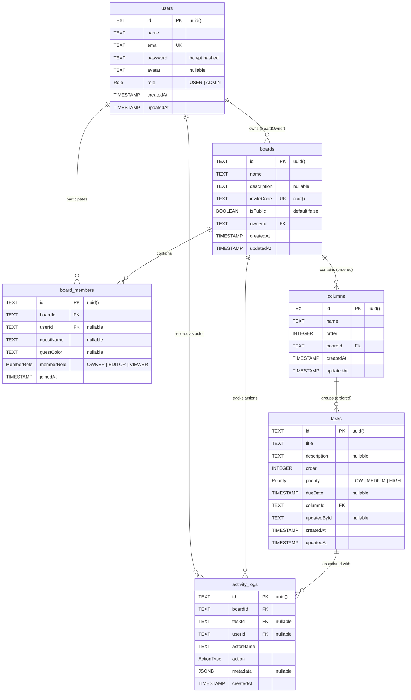

# Thiết kế Cơ sở Dữ liệu BambooSync (Database Design & Schema)

Tài liệu này mô tả chi tiết kiến trúc dữ liệu, cấu trúc bảng, các kiểu dữ liệu liệt kê (Enums), mối quan hệ thực thể (ERD) và quy trình quản lý Migration của **BambooSync Server** dựa trên mã nguồn thực tế tại `prisma/schema.prisma` và `prisma/migrations/`.

---

## 1. Hệ Quản trị Cơ sở Dữ liệu

- **Hệ thống**: **PostgreSQL 16** (được định nghĩa trong `docker-compose.yml` với image `postgres:16-alpine`).
- **ORM**: **Prisma ORM v6.19+** (`@prisma/client` và `prisma` CLI).
- **Quy ước khóa chính**: Sử dụng chuỗi định danh **UUID v4** (`@default(uuid())`) cho toàn bộ các bảng, ngoại trừ mã mời `inviteCode` sử dụng **CUID** (`@default(cuid())`).

---

## 2. Sơ đồ Quan hệ Thực thể (Entity Relationship Diagram - ERD)



---

## 3. Chi tiết Các Bảng và Trường Dữ liệu (Tables & Fields)

### 3.1. Bảng `users` (Tài khoản người dùng)
*Mapped từ model `User` qua `@@map("users")`.*

| Tên Cột | Kiểu Dữ Liệu | Ràng Buộc | Mô Tả |
|---------|--------------|-----------|-------|
| `id` | `TEXT` | `PRIMARY KEY`, `@default(uuid())` | Mã định danh duy nhất của người dùng |
| `name` | `TEXT` | `NOT NULL` | Họ tên hiển thị của người dùng |
| `email` | `TEXT` | `NOT NULL`, `UNIQUE` | Địa chỉ email dùng để đăng nhập |
| `password` | `TEXT` | `NOT NULL` | Mật khẩu đã được mã hóa bằng bcrypt (10 rounds) |
| `avatar` | `TEXT` | `NULL` | Đường dẫn ảnh đại diện |
| `role` | `Role` (Enum) | `NOT NULL`, `DEFAULT 'USER'` | Vai trò cấp hệ thống: `USER` hoặc `ADMIN` |
| `createdAt` | `TIMESTAMP(3)`| `NOT NULL`, `DEFAULT now()` | Thời điểm tạo tài khoản |
| `updatedAt` | `TIMESTAMP(3)`| `NOT NULL`, `auto update` | Thời điểm cập nhật thông tin gần nhất |

### 3.2. Bảng `boards` (Bảng công việc)
*Mapped từ model `Board` qua `@@map("boards")`.*

| Tên Cột | Kiểu Dữ Liệu | Ràng Buộc | Mô Tả |
|---------|--------------|-----------|-------|
| `id` | `TEXT` | `PRIMARY KEY`, `@default(uuid())` | Mã định danh duy nhất của bảng |
| `name` | `TEXT` | `NOT NULL` | Tên bảng công việc |
| `description` | `TEXT` | `NULL` | Mô tả chi tiết mục tiêu của bảng |
| `inviteCode` | `TEXT` | `NOT NULL`, `UNIQUE`, `@default(cuid())` | Mã mời ngắn dùng để chia sẻ đường link tham gia |
| `isPublic` | `BOOLEAN` | `NOT NULL`, `DEFAULT false` | Bật/tắt cho phép tham gia qua đường link mời |
| `ownerId` | `TEXT` | `NOT NULL`, `FK -> users(id)` | Khóa ngoại trỏ về người sở hữu bảng (`ON DELETE RESTRICT`) |
| `createdAt` | `TIMESTAMP(3)`| `NOT NULL`, `DEFAULT now()` | Thời điểm tạo bảng |
| `updatedAt` | `TIMESTAMP(3)`| `NOT NULL`, `auto update` | Thời điểm cập nhật bảng gần nhất |

### 3.3. Bảng `board_members` (Thành viên tham gia bảng)
*Mapped từ model `BoardMember` qua `@@map("board_members")`.*

| Tên Cột | Kiểu Dữ Liệu | Ràng Buộc | Mô Tả |
|---------|--------------|-----------|-------|
| `id` | `TEXT` | `PRIMARY KEY`, `@default(uuid())` | Khóa chính bản ghi thành viên |
| `boardId` | `TEXT` | `NOT NULL`, `FK -> boards(id)` | Bảng trực thuộc (`ON DELETE CASCADE`) |
| `userId` | `TEXT` | `NULL`, `FK -> users(id)` | Khóa ngoại tới user đăng ký (`ON DELETE SET NULL`) |
| `guestName` | `TEXT` | `NULL` | Tên hiển thị dành cho khách vãng lai không đăng ký |
| `guestColor` | `TEXT` | `NULL` | Mã màu đại diện của khách |
| `memberRole` | `MemberRole` (Enum) | `NOT NULL`, `DEFAULT 'EDITOR'` | Vai trò trong bảng: `OWNER`, `EDITOR`, `VIEWER` |
| `joinedAt` | `TIMESTAMP(3)`| `NOT NULL`, `DEFAULT now()` | Thời điểm gia nhập bảng |

> [!NOTE]
> Bảng có chỉ mục ràng buộc duy nhất phức hợp: `@@unique([boardId, userId])` ngăn chặn 1 user bị trùng lặp trong cùng 1 bảng.

### 3.4. Bảng `columns` (Cột trạng thái công việc)
*Mapped từ model `Column` qua `@@map("columns")`.*

| Tên Cột | Kiểu Dữ Liệu | Ràng Buộc | Mô Tả |
|---------|--------------|-----------|-------|
| `id` | `TEXT` | `PRIMARY KEY`, `@default(uuid())` | Khóa chính của cột |
| `name` | `TEXT` | `NOT NULL` | Tên hiển thị của cột (ví dụ: To Do, Doing, Done) |
| `order` | `INTEGER` | `NOT NULL` | Thứ tự sắp xếp từ trái sang phải trên giao diện |
| `boardId` | `TEXT` | `NOT NULL`, `FK -> boards(id)` | Thuộc về bảng nào (`ON DELETE CASCADE`) |
| `createdAt` | `TIMESTAMP(3)`| `NOT NULL`, `DEFAULT now()` | Thời điểm tạo cột |
| `updatedAt` | `TIMESTAMP(3)`| `NOT NULL`, `auto update` | Thời điểm cập nhật cột |

### 3.5. Bảng `tasks` (Thẻ công việc)
*Mapped từ model `Task` qua `@@map("tasks")`.*

| Tên Cột | Kiểu Dữ Liệu | Ràng Buộc | Mô Tả |
|---------|--------------|-----------|-------|
| `id` | `TEXT` | `PRIMARY KEY`, `@default(uuid())` | Khóa chính của thẻ công việc |
| `title` | `TEXT` | `NOT NULL` | Tiêu đề công việc |
| `description` | `TEXT` | `NULL` | Nội dung chi tiết/hướng dẫn của công việc |
| `order` | `INTEGER` | `NOT NULL` | Thứ tự sắp xếp từ trên xuống dưới trong cột |
| `priority` | `Priority` (Enum) | `NOT NULL`, `DEFAULT 'MEDIUM'` | Mức độ ưu tiên: `LOW`, `MEDIUM`, `HIGH` |
| `dueDate` | `TIMESTAMP(3)`| `NULL` | Thời hạn hoàn thành công việc |
| `columnId` | `TEXT` | `NOT NULL`, `FK -> columns(id)` | Cột chứa task (`ON DELETE CASCADE`) |
| `updatedById` | `TEXT` | `NULL` | ID của người dùng thực hiện cập nhật gần nhất |
| `createdAt` | `TIMESTAMP(3)`| `NOT NULL`, `DEFAULT now()` | Thời điểm tạo task |
| `updatedAt` | `TIMESTAMP(3)`| `NOT NULL`, `auto update` | Thời điểm cập nhật task |

### 3.6. Bảng `activity_logs` (Nhật ký thao tác)
*Mapped từ model `ActivityLog` qua `@@map("activity_logs")`.*

| Tên Cột | Kiểu Dữ Liệu | Ràng Buộc | Mô Tả |
|---------|--------------|-----------|-------|
| `id` | `TEXT` | `PRIMARY KEY`, `@default(uuid())` | Khóa chính bản ghi nhật ký |
| `boardId` | `TEXT` | `NOT NULL`, `FK -> boards(id)` | Thuộc về bảng nào (`ON DELETE CASCADE`) |
| `taskId` | `TEXT` | `NULL`, `FK -> tasks(id)` | Liên kết task (nếu có) (`ON DELETE SET NULL`) |
| `userId` | `TEXT` | `NULL`, `FK -> users(id)` | User thực hiện hành động (`ON DELETE SET NULL`) |
| `actorName` | `TEXT` | `NOT NULL` | Tên snapshot của người thực hiện tại thời điểm ghi log |
| `action` | `ActionType` (Enum) | `NOT NULL` | Loại hành động nghiệp vụ |
| `metadata` | `JSONB` | `NULL` | Dữ liệu phụ trợ dạng JSON (vị trí cũ/mới, title cũ,...) |
| `createdAt` | `TIMESTAMP(3)`| `NOT NULL`, `DEFAULT now()` | Thời điểm phát sinh sự kiện |

---

## 4. Các Kiểu Liệt Kê (Enums)

```sql
CREATE TYPE "Role" AS ENUM ('USER', 'ADMIN');
CREATE TYPE "MemberRole" AS ENUM ('OWNER', 'EDITOR', 'VIEWER');
CREATE TYPE "Priority" AS ENUM ('LOW', 'MEDIUM', 'HIGH');
CREATE TYPE "ActionType" AS ENUM (
    'TASK_CREATED',
    'TASK_MOVED',
    'TASK_UPDATED',
    'TASK_DELETED',
    'COLUMN_CREATED',
    'COLUMN_DELETED',
    'MEMBER_JOINED'
);
```

---

## 5. Quy Ước Đặt Tên (Naming Conventions)

1. **Model Prisma**: Sử dụng cú pháp **PascalCase** số ít (`User`, `Board`, `BoardMember`, `Column`, `Task`, `ActivityLog`).
2. **Tên Bảng Database**: Sử dụng cú pháp **snake_case số nhiều** thông qua directive `@@map("...")` (`users`, `boards`, `board_members`, `columns`, `tasks`, `activity_logs`).
3. **Tên Cột (Columns)**: Sử dụng cú pháp **camelCase** đồng nhất giữa schema Prisma và PostgreSQL (`inviteCode`, `ownerId`, `dueDate`, `actorName`).
4. **Foreign Keys**: Đặt theo mẫu `<targetEntity>Id` (ví dụ: `boardId`, `columnId`, `ownerId`, `userId`).

---

## 6. Hướng Dẫn Quản Trị Migrations với Prisma

### 6.1. Tạo Migration Mới trong Môi trường Phát triển (Development)
Sau khi chỉnh sửa cấu trúc file `prisma/schema.prisma`:
```bash
# Prisma sẽ so sánh schema với DB hiện tại, tạo file migration SQL mới và áp dụng ngay lập tức
pnpm prisma migrate dev --name <ten_mo_ta_thay_doi>

# Ví dụ:
pnpm prisma migrate dev --name add_task_tags
```

### 6.2. Sinh lại Prisma Client
Khi schema thay đổi, cần cập nhật lại TypeScript type definitions trong `@prisma/client`:
```bash
pnpm prisma generate
```

### 6.3. Áp dụng Migration trên Môi trường Production / Staging
Trên môi trường triển khai thực tế (không tạo file migration mới, chỉ chạy các file `.sql` chưa áp dụng):
```bash
pnpm prisma migrate deploy
```

### 6.4. Kiểm tra Trạng thái Migration
Kiểm tra xem database có đang đồng bộ hoàn toàn với các file migration trong mã nguồn hay không:
```bash
pnpm prisma migrate status
```

### 6.5. Mở Giao diện Quản trị Dữ liệu (Prisma Studio)
Mở giao diện web trực quan để duyệt và chỉnh sửa dữ liệu nhanh:
```bash
pnpm prisma studio
```

### 6.6. Quy trình Rollback Migration
Prisma không hỗ trợ lệnh `migrate down` tự động như Knex hoặc TypeORM. Để rollback một migration:
1. **Nếu đang ở Local Dev**: Có thể reset toàn bộ DB về trạng thái sạch:
   ```bash
   pnpm prisma migrate reset
   ```
2. **Nếu ở Production**:
   - Viết một migration mới để đảo ngược các câu lệnh SQL của migration bị lỗi:
     ```bash
     pnpm prisma migrate dev --name revert_previous_change
     ```
   - Trong trường hợp migration bị đánh dấu lỗi (`failed`), sử dụng:
     ```bash
     pnpm prisma migrate resolve --rolled-back <migration_folder_name>
     ```
